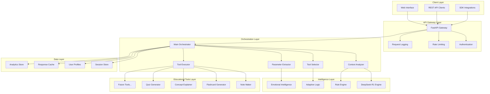
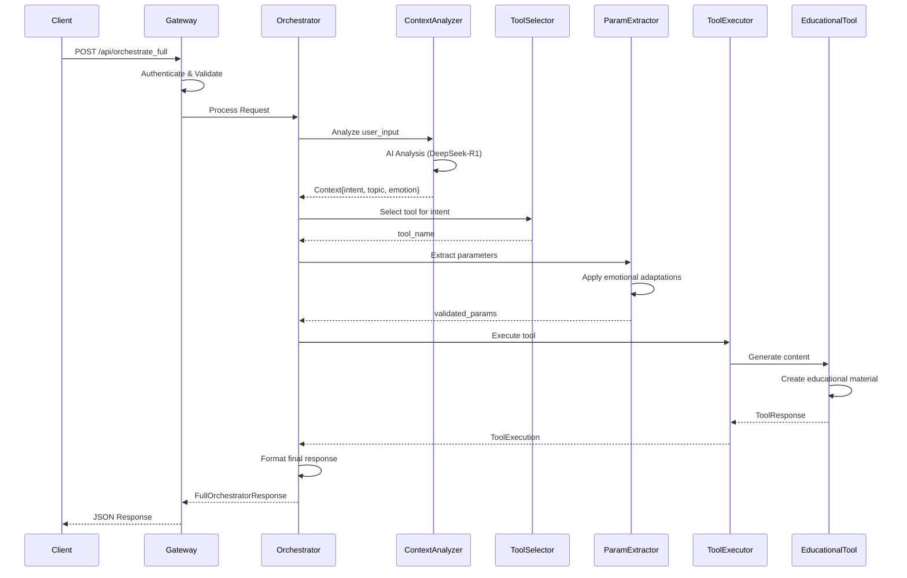

# Architecture Documentation

## System Overview

The YoLearn.ai Orchestrator is designed as a **multi-agent intelligent system** that transforms natural language educational requests into personalized learning experiences. The architecture emphasizes **modularity**, **scalability**, and **emotional intelligence** to create the most advanced autonomous tutoring system.

**Core Philosophy**: *Context → Intelligence → Action → Adaptation*

***

## Table of Contents

1. [High-Level Architecture](#high-level-architecture)
2. [System Components](#system-components)
3. [Data Flow & Processing Pipeline](#data-flow--processing-pipeline)
4. [Agent Design Patterns](#agent-design-patterns)
5. [Educational Tool Integration](#educational-tool-integration)
6. [Emotional Intelligence System](#emotional-intelligence-system)
7. [Scalability & Performance](#scalability--performance)
8. [Security & Reliability](#security--reliability)
9. [Deployment Architecture](#deployment-architecture)
10. [Future Architecture Evolution](#future-architecture-evolution)

***

## High-Level Architecture

### System Diagram



### Architectural Principles

#### 1. **Separation of Concerns**
- Each component has a single, well-defined responsibility
- Minimal coupling between components
- High cohesion within components

#### 2. **Emotional Intelligence First**
- Every decision considers student emotional state
- Adaptive difficulty and content presentation
- Empathetic response generation

#### 3. **Zero-Cost AI Operations**
- DeepSeek-R1 eliminates per-request AI costs
- Intelligent caching to minimize AI calls
- Fallback mechanisms for AI unavailability

#### 4. **Educational Effectiveness**
- Schema-compliant tool integration
- Research-based learning methodologies
- Continuous adaptation based on student progress

#### 5. **Infinite Scalability**
- Tool-agnostic orchestration framework
- Schema-driven integration patterns
- Horizontal scaling capabilities

***

## System Components

### 1. **API Gateway Layer**

#### FastAPI Gateway
```python
# Core gateway implementation
class OrchestratorGateway:
    def __init__(self):
        self.app = FastAPI(
            title="YoLearn.ai Orchestrator",
            version="1.0.0",
            docs_url="/docs",
            redoc_url="/redoc"
        )
        self.setup_middleware()
        self.setup_routes()
    
    def setup_middleware(self):
        # CORS, authentication, rate limiting
        pass
```

**Responsibilities**:
- HTTP request/response handling
- Authentication and authorization
- Rate limiting and throttling
- Request validation and sanitization
- Response formatting and caching
- Error handling and logging

**Key Features**:
- **Async Processing**: Non-blocking request handling
- **Auto Documentation**: OpenAPI/Swagger integration
- **Validation**: Pydantic schema validation
- **Middleware Stack**: Modular request processing

#### Authentication System
```python
class AuthenticationMiddleware:
    async def authenticate_request(self, request: Request):
        # Validate HF_TOKEN
        # Check API rate limits
        # Log request metadata
        pass
```

### 2. **Orchestration Layer**

#### Main Orchestrator
```python
class EducationalOrchestrator:
    def __init__(self):
        self.context_analyzer = ContextAnalyzer()
        self.tool_selector = ToolSelector() 
        self.param_extractor = ParameterExtractor()
        self.tool_executor = ToolExecutor()
        
    async def orchestrate(self, request: OrchestratorRequest):
        # 1. Analyze context
        context = await self.context_analyzer.analyze(request.user_input)
        
        # 2. Select appropriate tool
        tool = self.tool_selector.select(context.intent)
        
        # 3. Extract and adapt parameters
        params = self.param_extractor.extract(context, request.user_info)
        
        # 4. Execute tool
        result = await self.tool_executor.execute(tool, params)
        
        # 5. Format response
        return self.format_response(result, context)
```

**Responsibilities**:
- Coordinate all system components
- Manage request lifecycle
- Handle errors and fallbacks
- Ensure response quality
- Track analytics and metrics

#### Context Analyzer
```python
class ContextAnalyzer:
    def __init__(self):
        self.ai_client = OpenAI(base_url=HF_ROUTER_URL)
        self.rule_engine = RuleBasedExtractor()
        
    async def analyze(self, user_input: str) -> AnalysisContext:
        try:
            # Primary: AI-powered analysis
            return await self.ai_analyze(user_input)
        except Exception:
            # Fallback: Rule-based analysis
            return self.rule_engine.analyze(user_input)
    
    async def ai_analyze(self, user_input: str):
        prompt = self.create_analysis_prompt()
        response = await self.ai_client.chat.completions.create(
            model="deepseek-ai/DeepSeek-R1",
            messages=[
                {"role": "system", "content": prompt},
                {"role": "user", "content": user_input}
            ]
        )
        return self.parse_ai_response(response)
```

**Responsibilities**:
- Extract intent from natural language
- Identify educational topics and subtopics
- Detect emotional state and confidence levels
- Determine urgency and complexity
- Provide fallback analysis when AI unavailable

#### Tool Selector
```python
class ToolSelector:
    def __init__(self):
        self.tool_registry = EducationalToolRegistry()
        self.selection_rules = SelectionRuleEngine()
        
    def select(self, context: AnalysisContext) -> str:
        # Intent-based primary selection
        primary_tool = self.intent_to_tool_mapping(context.intent)
        
        # Emotional state modifiers
        if context.emotional_state == "frustrated":
            return self.select_supportive_variant(primary_tool)
        elif context.emotional_state == "confident":
            return self.select_challenging_variant(primary_tool)
            
        return primary_tool
    
    def intent_to_tool_mapping(self, intent: str) -> str:
        mapping = {
            "request_practice_problems": "flashcard_generator",
            "explanation": "concept_explainer", 
            "notes": "note_maker",
            "summary": "note_maker"
        }
        return mapping.get(intent, "flashcard_generator")
```

**Responsibilities**:
- Map intents to appropriate educational tools
- Consider emotional state in tool selection
- Apply business rules and preferences
- Handle tool availability and fallbacks
- Support A/B testing for tool effectiveness

#### Parameter Extractor
```python
class ParameterExtractor:
    def __init__(self):
        self.schema_registry = SchemaRegistry()
        self.adaptation_engine = AdaptationEngine()
        
    def extract(self, context: AnalysisContext, user_info: UserInfo) -> Dict:
        tool_name = context.selected_tool
        schema = self.schema_registry.get_schema(tool_name)
        
        # Build base parameters
        params = self.build_base_params(schema, context, user_info)
        
        # Apply emotional intelligence adaptations
        params = self.adaptation_engine.adapt(params, context.emotional_state)
        
        # Validate against schema
        return self.validate_params(params, schema)
```

**Responsibilities**:
- Transform context into tool-specific parameters
- Apply schema validation and defaults
- Implement emotional intelligence adaptations
- Handle parameter conflicts and constraints
- Ensure educational effectiveness

### 3. **Intelligence Layer**

#### DeepSeek-R1 Engine
```python
class DeepSeekEngine:
    def __init__(self):
        self.client = OpenAI(
            base_url="https://router.huggingface.co/v1",
            api_key=os.environ["HF_TOKEN"]
        )
        self.prompt_manager = PromptManager()
        self.response_cache = ResponseCache()
        
    async def analyze_context(self, user_input: str) -> Dict:
        # Check cache first
        cached = await self.response_cache.get(user_input)
        if cached:
            return cached
            
        # Generate analysis
        prompt = self.prompt_manager.get_analysis_prompt()
        response = await self.client.chat.completions.create(
            model="deepseek-ai/DeepSeek-R1",
            messages=[
                {"role": "system", "content": prompt},
                {"role": "user", "content": user_input}
            ],
            temperature=0.7,
            max_tokens=200
        )
        
        # Cache and return
        result = self.parse_response(response)
        await self.response_cache.set(user_input, result)
        return result
```

**Responsibilities**:
- Natural language understanding
- Context extraction and interpretation
- Emotional state detection
- Intent classification
- Fallback response generation

#### Emotional Intelligence System
```python
class EmotionalIntelligenceEngine:
    def __init__(self):
        self.emotion_detector = EmotionDetector()
        self.adaptation_rules = AdaptationRuleEngine()
        
    def adapt_parameters(self, params: Dict, emotional_state: str) -> Dict:
        adaptations = {
            "frustrated": self.handle_frustration,
            "confident": self.handle_confidence,
            "confused": self.handle_confusion,
            "anxious": self.handle_anxiety
        }
        
        handler = adaptations.get(emotional_state, self.handle_neutral)
        return handler(params)
    
    def handle_frustration(self, params: Dict) -> Dict:
        # Reduce cognitive load
        if "difficulty" in params:
            params["difficulty"] = "easy"
        if "count" in params:
            params["count"] = min(params["count"], 3)
        if "include_encouragement" in params:
            params["include_encouragement"] = True
        return params
    
    def handle_confidence(self, params: Dict) -> Dict:
        # Increase challenge
        if "difficulty" in params:
            params["difficulty"] = "hard"
        if "count" in params:
            params["count"] = min(params["count"] + 2, 10)
        if "include_advanced_concepts" in params:
            params["include_advanced_concepts"] = True
        return params
```

**Responsibilities**:
- Emotional state-based adaptation
- Difficulty level adjustment
- Content quantity optimization
- Learning style accommodation
- Motivational enhancement

### 4. **Educational Tools Layer**

#### Tool Architecture Pattern
```python
class BaseEducationalTool:
    def __init__(self, tool_name: str):
        self.tool_name = tool_name
        self.schema = self.load_schema()
        self.validator = SchemaValidator(self.schema)
        
    async def execute(self, params: Dict) -> ToolResponse:
        # 1. Validate parameters
        validated_params = self.validator.validate(params)
        
        # 2. Generate content
        content = await self.generate_content(validated_params)
        
        # 3. Format response
        return self.format_response(content, validated_params)
    
    @abstractmethod
    async def generate_content(self, params: Dict) -> Any:
        pass
    
    @abstractmethod
    def format_response(self, content: Any, params: Dict) -> ToolResponse:
        pass
```

#### Flashcard Generator
```python
class FlashcardGenerator(BaseEducationalTool):
    async def generate_content(self, params: Dict) -> List[Flashcard]:
        topic = params["topic"]
        difficulty = params["difficulty"]
        count = params["count"]
        
        # Subject-specific content generation
        if "calculus" in topic.lower():
            return await self.generate_calculus_flashcards(topic, difficulty, count)
        elif "biology" in topic.lower():
            return await self.generate_biology_flashcards(topic, difficulty, count)
        else:
            return await self.generate_generic_flashcards(topic, difficulty, count)
    
    async def generate_calculus_flashcards(self, topic: str, difficulty: str, count: int):
        templates = {
            "easy": [
                ("Definition", "What is a derivative?", "Rate of change of a function"),
                ("Basic Rule", "What is d/dx(x²)?", "2x")
            ],
            "medium": [
                ("Product Rule", "d/dx(x·sin(x)) = ?", "sin(x) + x·cos(x)"),
                ("Chain Rule", "d/dx(sin(x²)) = ?", "2x·cos(x²)")
            ],
            "hard": [
                ("Implicit Differentiation", "Find dy/dx for x² + y² = 25", "-x/y"),
                ("Related Rates", "Balloon volume changing at 10 cm³/s", "dV/dt = 4πr²·dr/dt")
            ]
        }
        
        selected_templates = templates.get(difficulty, templates["easy"])
        flashcards = []
        
        for i in range(min(count, len(selected_templates))):
            title, question, answer = selected_templates[i]
            flashcards.append(Flashcard(
                title=title,
                question=question,
                answer=answer,
                example=self.generate_example(title, difficulty)
            ))
            
        return flashcards
```

#### Note Maker
```python
class NoteMaker(BaseEducationalTool):
    async def generate_content(self, params: Dict) -> NotesContent:
        topic = params["topic"]
        style = params["note_taking_style"]
        include_examples = params["include_examples"]
        
        # Generate structured content
        sections = await self.generate_sections(topic, include_examples)
        
        # Apply formatting style
        formatted_sections = self.apply_formatting(sections, style)
        
        return NotesContent(
            title=f"Study Notes: {topic.replace('_', ' ').title()}",
            sections=formatted_sections,
            key_concepts=self.extract_key_concepts(sections),
            practice_suggestions=self.generate_practice_suggestions(topic)
        )
```

#### Concept Explainer
```python
class ConceptExplainer(BaseEducationalTool):
    async def generate_content(self, params: Dict) -> ConceptExplanation:
        concept = params["concept_to_explain"]
        depth = params["desired_depth"]
        user_level = params["user_info"]["mastery_level_summary"]
        
        # Generate explanation based on depth and user level
        explanation = await self.generate_explanation(concept, depth, user_level)
        examples = await self.generate_examples(concept, depth)
        
        return ConceptExplanation(
            explanation=explanation,
            examples=examples,
            related_concepts=self.find_related_concepts(concept),
            practice_questions=self.generate_practice_questions(concept, depth)
        )
```

***

## Data Flow & Processing Pipeline

### Request Processing Flow



### Data Transformation Pipeline

#### Stage 1: Input Processing
```
Raw Input: "I'm struggling with calculus derivatives and need practice problems"
↓
Normalized Input: {
  text: "struggling calculus derivatives practice problems",
  metadata: {length: 67, language: "en", complexity: "medium"}
}
```

#### Stage 2: Context Analysis
```
AI Analysis → {
  intent: "request_practice_problems",
  topic: "calculus_derivatives", 
  emotional_state: "frustrated",
  confidence_level: 0.85,
  urgency: "medium",
  learning_objective: "skill_practice"
}
```

#### Stage 3: Tool Selection & Parameter Extraction
```
Tool Selection → "flashcard_generator"
↓
Base Parameters → {
  user_info: {...},
  topic: "calculus_derivatives",
  count: 5,
  difficulty: "medium",
  subject: "calculus"
}
↓
Emotional Adaptation → {
  count: 3,              // Reduced due to frustration
  difficulty: "easy",    // Lowered due to struggle
  include_encouragement: true,
  include_examples: true
}
```

#### Stage 4: Content Generation
```
Tool Execution → {
  flashcards: [
    {
      title: "Definition",
      question: "What is a derivative?",
      answer: "Rate of change...",
      example: "Speed is derivative..."
    }
  ],
  adaptation_details: "Generated easy level flashcards..."
}
```

#### Stage 5: Response Formatting
```
Final Response → {
  success: true,
  response: "Created 3 easy flashcards on calculus_derivatives",
  tool_execution: {...},
  suggestions: [...],
  next_actions: [...]
}
```

***

## Agent Design Patterns

### 1. **Context-Aware Agents**

Each agent maintains awareness of:
- **Student Context**: Emotional state, learning style, mastery level
- **Session Context**: Conversation history, previous interactions
- **Educational Context**: Subject domain, learning objectives
- **System Context**: Available tools, resource constraints

```python
class ContextAwareAgent:
    def __init__(self):
        self.context_store = ContextStore()
        
    async def process_with_context(self, request, context):
        # Enrich request with contextual information
        enriched_request = await self.enrich_request(request, context)
        
        # Process with full awareness
        result = await self.process(enriched_request)
        
        # Update context with results
        await self.context_store.update(context.session_id, result)
        
        return result
```

### 2. **Adaptive Learning Agents**

Agents that learn and improve from interactions:

```python
class AdaptiveAgent:
    def __init__(self):
        self.performance_tracker = PerformanceTracker()
        self.adaptation_engine = AdaptationEngine()
        
    async def execute_and_learn(self, task, context):
        # Execute task
        result = await self.execute(task, context)
        
        # Track performance
        performance = await self.evaluate_performance(result, context)
        self.performance_tracker.record(task, performance)
        
        # Adapt for future tasks
        adaptations = self.adaptation_engine.generate_adaptations(performance)
        await self.apply_adaptations(adaptations)
        
        return result
```

### 3. **Collaborative Agent Network**

Agents that work together to achieve educational goals:

```python
class CollaborativeAgentNetwork:
    def __init__(self):
        self.agents = {
            "context_analyzer": ContextAnalyzer(),
            "content_generator": ContentGenerator(),
            "difficulty_adapter": DifficultyAdapter(),
            "engagement_optimizer": EngagementOptimizer()
        }
        self.message_bus = AgentMessageBus()
        
    async def collaborate(self, task):
        # Distribute task across agents
        subtasks = self.decompose_task(task)
        
        # Execute subtasks collaboratively
        results = await self.execute_collaborative(subtasks)
        
        # Synthesize final result
        return self.synthesize_results(results)
```

***

## Educational Tool Integration

### Schema-Driven Integration Framework

```python
class ToolIntegrationFramework:
    def __init__(self):
        self.schema_registry = SchemaRegistry()
        self.tool_adapters = ToolAdapterRegistry()
        
    def register_tool(self, tool_name: str, schema: Dict, adapter: ToolAdapter):
        # Register tool schema
        self.schema_registry.register(tool_name, schema)
        
        # Register adapter for tool communication
        self.tool_adapters.register(tool_name, adapter)
        
    async def execute_tool(self, tool_name: str, params: Dict):
        # Validate parameters against schema
        schema = self.schema_registry.get(tool_name)
        validated_params = self.validate_params(params, schema)
        
        # Get appropriate adapter
        adapter = self.tool_adapters.get(tool_name)
        
        # Execute through adapter
        result = await adapter.execute(validated_params)
        
        # Validate response against schema
        return self.validate_response(result, schema)
```

### Tool Adapter Pattern

```python
class BaseToolAdapter:
    def __init__(self, tool_name: str, endpoint: str):
        self.tool_name = tool_name
        self.endpoint = endpoint
        self.client = AsyncHttpClient()
        
    async def execute(self, params: Dict) -> ToolResponse:
        try:
            # Make API call to educational tool
            response = await self.client.post(
                url=self.endpoint,
                json=params,
                timeout=30
            )
            return self.parse_response(response)
        except Exception as e:
            # Fallback to mock implementation
            return await self.mock_execute(params)
    
    @abstractmethod
    async def mock_execute(self, params: Dict) -> ToolResponse:
        """Fallback implementation for tool unavailability"""
        pass
```

### Dynamic Tool Discovery

```python
class ToolDiscoveryService:
    def __init__(self):
        self.tool_registry = ToolRegistry()
        self.health_checker = ToolHealthChecker()
        
    async def discover_available_tools(self):
        # Scan for available tools
        available_tools = []
        
        for tool in self.tool_registry.list_all():
            if await self.health_checker.is_healthy(tool):
                available_tools.append(tool)
                
        return available_tools
    
    async def select_best_tool(self, intent: str, context: Context):
        available_tools = await self.discover_available_tools()
        suitable_tools = self.filter_by_intent(available_tools, intent)
        
        # Select based on context and performance history
        return self.rank_and_select(suitable_tools, context)
```

***

## Emotional Intelligence System

### Emotion Detection Architecture

```python
class EmotionDetectionSystem:
    def __init__(self):
        self.text_analyzer = TextBasedEmotionAnalyzer()
        self.pattern_matcher = EmotionalPatternMatcher()
        self.context_enhancer = ContextualEmotionEnhancer()
        
    async def detect_emotions(self, text: str, context: Context) -> EmotionalState:
        # Multi-modal emotion detection
        text_emotions = await self.text_analyzer.analyze(text)
        pattern_emotions = self.pattern_matcher.match(text, context)
        
        # Enhance with contextual information
        enhanced_emotions = self.context_enhancer.enhance(
            text_emotions, pattern_emotions, context
        )
        
        return EmotionalState(
            primary_emotion=enhanced_emotions.primary,
            confidence=enhanced_emotions.confidence,
            intensity=enhanced_emotions.intensity,
            contributing_factors=enhanced_emotions.factors
        )
```

### Adaptive Response System

```python
class AdaptiveResponseSystem:
    def __init__(self):
        self.response_strategies = ResponseStrategyRegistry()
        self.personalization_engine = PersonalizationEngine()
        
    def adapt_response(self, base_response: Response, emotional_state: EmotionalState, user_profile: UserProfile) -> Response:
        # Select appropriate response strategy
        strategy = self.response_strategies.get_strategy(emotional_state.primary_emotion)
        
        # Apply strategy adaptations
        adapted_response = strategy.adapt(base_response, emotional_state)
        
        # Personalize for specific user
        personalized_response = self.personalization_engine.personalize(
            adapted_response, user_profile
        )
        
        return personalized_response
```

### Learning Path Optimization

```python
class LearningPathOptimizer:
    def __init__(self):
        self.difficulty_calculator = DifficultyCalculator()
        self.progress_tracker = ProgressTracker()
        self.optimization_engine = OptimizationEngine()
        
    def optimize_path(self, current_state: LearningState, target_objectives: List[Objective]) -> LearningPath:
        # Calculate optimal difficulty progression
        difficulty_curve = self.difficulty_calculator.calculate_curve(
            current_state, target_objectives
        )
        
        # Generate learning activities
        activities = self.generate_activities(difficulty_curve, current_state)
        
        # Optimize sequence and timing
        optimized_path = self.optimization_engine.optimize(activities)
        
        return LearningPath(
            activities=optimized_path,
            estimated_duration=self.calculate_duration(optimized_path),
            success_probability=self.calculate_success_probability(optimized_path)
        )
```

***

## Scalability & Performance

### Horizontal Scaling Architecture

```python
class ScalableOrchestrator:
    def __init__(self):
        self.load_balancer = LoadBalancer()
        self.worker_pool = WorkerPool()
        self.cache_layer = DistributedCache()
        
    async def process_request(self, request: OrchestratorRequest):
        # Distribute load across workers
        worker = await self.load_balancer.select_worker(request)
        
        # Process with caching
        cache_key = self.generate_cache_key(request)
        cached_result = await self.cache_layer.get(cache_key)
        
        if cached_result:
            return cached_result
            
        # Process request
        result = await worker.process(request)
        
        # Cache result
        await self.cache_layer.set(cache_key, result, ttl=3600)
        
        return result
```

### Performance Optimization Strategies

#### 1. **Intelligent Caching**
```python
class IntelligentCache:
    def __init__(self):
        self.context_cache = ContextCache()
        self.response_cache = ResponseCache()
        self.computation_cache = ComputationCache()
        
    async def get_cached_response(self, request: Request) -> Optional[Response]:
        # Check for exact match
        exact_match = await self.response_cache.get(request.hash())
        if exact_match:
            return exact_match
            
        # Check for similar context
        similar_context = await self.context_cache.find_similar(request.context)
        if similar_context:
            return await self.adapt_cached_response(similar_context, request)
            
        return None
```

#### 2. **Async Processing Pipeline**
```python
class AsyncProcessingPipeline:
    async def process_request(self, request: Request):
        # Process stages concurrently where possible
        async with asyncio.TaskGroup() as tg:
            context_task = tg.create_task(self.analyze_context(request))
            user_task = tg.create_task(self.fetch_user_profile(request.user_id))
            session_task = tg.create_task(self.load_session(request.session_id))
        
        # Combine results
        context = context_task.result()
        user_profile = user_task.result()
        session = session_task.result()
        
        # Continue processing
        return await self.orchestrate(context, user_profile, session)
```

#### 3. **Resource Optimization**
```python
class ResourceOptimizer:
    def __init__(self):
        self.ai_call_optimizer = AICallOptimizer()
        self.memory_manager = MemoryManager()
        self.connection_pool = ConnectionPool()
        
    async def optimize_ai_usage(self, request: Request):
        # Minimize AI calls through intelligent routing
        if self.ai_call_optimizer.can_use_rules(request):
            return await self.rule_based_processing(request)
        else:
            return await self.ai_based_processing(request)
```

### Database Architecture

```python
class DataArchitecture:
    def __init__(self):
        # Primary database for user data
        self.primary_db = PostgreSQLConnection()
        
        # Cache layer for sessions and frequent data
        self.cache_db = RedisConnection()
        
        # Analytics database for learning insights
        self.analytics_db = ClickHouseConnection()
        
        # Search index for content discovery
        self.search_index = ElasticsearchConnection()
```

***

## Security & Reliability

### Security Architecture

```python
class SecurityLayer:
    def __init__(self):
        self.auth_manager = AuthenticationManager()
        self.encryption_service = EncryptionService()
        self.audit_logger = AuditLogger()
        
    async def secure_request(self, request: Request) -> SecureRequest:
        # Authenticate and authorize
        user = await self.auth_manager.authenticate(request.token)
        await self.auth_manager.authorize(user, request.action)
        
        # Encrypt sensitive data
        encrypted_data = await self.encryption_service.encrypt(request.data)
        
        # Log security events
        await self.audit_logger.log_access(user, request)
        
        return SecureRequest(user=user, data=encrypted_data)
```

### Reliability Patterns

#### Circuit Breaker Pattern
```python
class CircuitBreaker:
    def __init__(self, failure_threshold=5, recovery_timeout=60):
        self.failure_count = 0
        self.failure_threshold = failure_threshold
        self.recovery_timeout = recovery_timeout
        self.state = "CLOSED"  # CLOSED, OPEN, HALF_OPEN
        self.last_failure_time = None
        
    async def call(self, func, *args, **kwargs):
        if self.state == "OPEN":
            if self._should_attempt_reset():
                self.state = "HALF_OPEN"
            else:
                raise CircuitBreakerOpenError()
                
        try:
            result = await func(*args, **kwargs)
            await self._on_success()
            return result
        except Exception as e:
            await self._on_failure()
            raise e
```

#### Retry with Exponential Backoff
```python
class RetryManager:
    async def retry_with_backoff(self, func, max_retries=3, base_delay=1):
        for attempt in range(max_retries):
            try:
                return await func()
            except RetryableException as e:
                if attempt == max_retries - 1:
                    raise e
                    
                delay = base_delay * (2 ** attempt)
                await asyncio.sleep(delay)
```

***

## Deployment Architecture

### Container Architecture

```dockerfile
# Multi-stage build for optimization
FROM python:3.11-slim as builder
WORKDIR /app
COPY requirements.txt .
RUN pip install --no-cache-dir -r requirements.txt

FROM python:3.11-slim as runtime
WORKDIR /app
COPY --from=builder /usr/local/lib/python3.11/site-packages /usr/local/lib/python3.11/site-packages
COPY . .

# Health check
HEALTHCHECK --interval=30s --timeout=10s --start-period=5s --retries=3 \
  CMD curl -f http://localhost:8000/health || exit 1

EXPOSE 8000
CMD ["uvicorn", "app:app", "--host", "0.0.0.0", "--port", "8000"]
```

### Kubernetes Deployment

```yaml
apiVersion: apps/v1
kind: Deployment
metadata:
  name: yolearn-orchestrator
spec:
  replicas: 3
  selector:
    matchLabels:
      app: yolearn-orchestrator
  template:
    metadata:
      labels:
        app: yolearn-orchestrator
    spec:
      containers:
      - name: orchestrator
        image: yolearn/orchestrator:latest
        ports:
        - containerPort: 8000
        env:
        - name: HF_TOKEN
          valueFrom:
            secretKeyRef:
              name: hf-secret
              key: token
        resources:
          requests:
            memory: "256Mi"
            cpu: "250m"
          limits:
            memory: "512Mi"
            cpu: "500m"
        livenessProbe:
          httpGet:
            path: /health
            port: 8000
          initialDelaySeconds: 30
          periodSeconds: 10
```

### Infrastructure as Code

```terraform
# AWS ECS deployment
resource "aws_ecs_service" "orchestrator" {
  name            = "yolearn-orchestrator"
  cluster         = aws_ecs_cluster.main.id
  task_definition = aws_ecs_task_definition.orchestrator.arn
  desired_count   = 3

  load_balancer {
    target_group_arn = aws_lb_target_group.orchestrator.arn
    container_name   = "orchestrator"
    container_port   = 8000
  }

  deployment_configuration {
    maximum_percent         = 200
    minimum_healthy_percent = 100
  }
}
```

***

## Future Architecture Evolution

### Phase 1: Enhanced AI Integration (Q1 2026)
- **Multi-Model AI**: Integration with GPT-4, Claude, and Gemini for comparison
- **Fine-Tuned Models**: Custom models trained on educational data
- **AI Agent Swarms**: Multiple specialized AI agents working collaboratively

### Phase 2: Advanced Personalization (Q2 2026)
- **ML-Driven Adaptation**: Machine learning models for personalization
- **Predictive Analytics**: Anticipating student needs before they ask
- **Behavioral Analysis**: Deep understanding of learning patterns

### Phase 3: Multimodal Interface (Q3 2026)
- **Voice Integration**: Speech-to-text and text-to-speech capabilities
- **Visual Processing**: Image and diagram understanding
- **AR/VR Support**: Immersive learning experiences

### Phase 4: Distributed Intelligence (Q4 2026)
- **Edge Computing**: Local processing for reduced latency
- **Federated Learning**: Privacy-preserving collaborative learning
- **Blockchain Integration**: Decentralized credentialing and verification

### Evolutionary Architecture Principles

```python
class EvolutionaryArchitecture:
    def __init__(self):
        self.fitness_evaluator = ArchitecturalFitnessEvaluator()
        self.mutation_engine = ArchitecturalMutationEngine()
        self.selection_mechanism = ArchitecturalSelectionMechanism()
        
    async def evolve_architecture(self):
        # Evaluate current architecture fitness
        current_fitness = await self.fitness_evaluator.evaluate()
        
        # Generate architectural mutations
        mutations = self.mutation_engine.generate_mutations()
        
        # Test mutations in sandbox environment
        mutation_results = await self.test_mutations(mutations)
        
        # Select best performing mutations
        selected_changes = self.selection_mechanism.select(mutation_results)
        
        # Apply gradual architectural evolution
        await self.apply_evolutionary_changes(selected_changes)
```

***

This architecture documentation provides a comprehensive view of the YoLearn.ai Orchestrator system, from high-level design principles to detailed implementation patterns. The architecture is designed to be **educational-first**, **emotionally intelligent**, and **infinitely scalable**, representing the future of personalized learning technology.

The system's modular design ensures that each component can evolve independently while maintaining the overall educational effectiveness and user experience that makes YoLearn.ai a breakthrough in AI-powered education.

